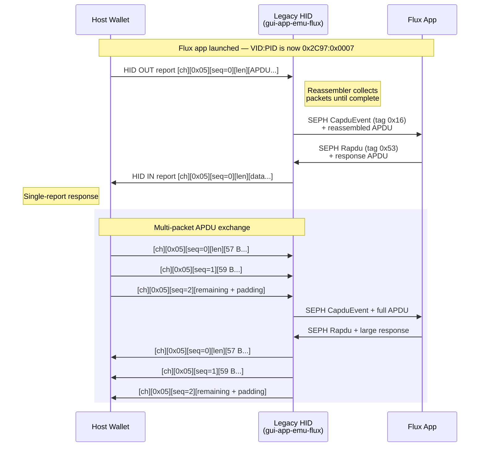
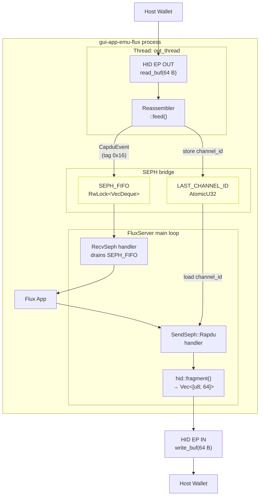

# Legacy Mode HID — Ledger-Compatible APDU Interface

When a Flux app launches, `gui-app-emu-flux` registers a second HID interface that
speaks the Ledger HID transport protocol. This allows unmodified host wallets
(MoneroGUI, Ledger Live, Speculos-compatible tools, etc.) to communicate with the
Flux app over standard ISO 7816 APDUs.

**Lifecycle:**

1. Flux app starts → `start_hid()` registers the Legacy HID interface, switches
   VID:PID to `0x2C97:0x0007` (Ledger Flex), and promotes the interface to
   position 0. The USB bus re-enumerates.
2. Flux app exits → normal VID:PID (`0x1307:0x0165`) is restored and the Legacy
   HID interface is removed. The USB bus re-enumerates again.

**Source files:**
- USB descriptors & endpoint setup: `apps/gui-app-emu-flux/src/flux/atsama5d2.rs`
- HID framing protocol: `apps/gui-app-emu-flux/src/flux/hid.rs`
- APDU dispatch (SEPH): `apps/gui-app-emu-flux/src/flux/mod.rs`

## Interface Descriptor

| Field | Value |
|-------|-------|
| bInterfaceClass | `0x03` (HID) |
| bInterfaceSubClass | `0x00` |
| bInterfaceProtocol | `0x00` |
| bNumEndpoints | 2 |

**Endpoints:**

| Endpoint | Type | Direction | Max Packet | Interval | DMA |
|----------|------|-----------|------------|----------|-----|
| EP IN | Interrupt | Device → Host | 64 B | 1 ms | No |
| EP OUT | Interrupt | Host → Device | 64 B | 1 ms | No |

**HID Functional Descriptor (9 bytes):**

| Field | Value |
|-------|-------|
| bcdHID | 1.11 |
| bCountryCode | 0x00 |
| bNumDescriptors | 1 |
| bDescriptorType | 0x22 (Report) |
| wDescriptorLength | 34 |

## HID Report Descriptor (34 bytes)

```
06 A0 FF    Usage Page (0xFFA0 — vendor-defined)
09 01       Usage (0x01 — vendor-defined)
A1 01       Collection (Application)
  09 03       Usage (Input)
  15 00       Logical Minimum (0)
  26 FF 00    Logical Maximum (255)
  75 08       Report Size (8 bits)
  95 40       Report Count (64)
  81 08       Input  (Data, Variable, Absolute)
  09 04       Usage (Output)
  15 00       Logical Minimum (0)
  26 FF 00    Logical Maximum (255)
  75 08       Report Size (8 bits)
  95 40       Report Count (64)
  91 08       Output (Data, Variable, Absolute)
C0          End Collection
```

> Usage Page `0xFFA0` is the vendor-defined page used by Ledger devices.
> This is distinct from the FIDO Alliance page `0xF1D0` used by the CTAP/U2F
> interface on Interface 0 (normal mode).

## APDU-over-HID Framing Protocol

ISO 7816 APDUs are split across 64-byte HID reports using the Ledger HID
transport framing. Each report carries a 2-byte channel ID, a tag byte (`0x05`
for APDU), and a 2-byte big-endian sequence number.

**Initialization Packet** (sequence = `0x0000`):

```
┌────────────┬──────┬────────────┬────────────┬──────────────────┐
│ Channel ID │ Tag  │ Sequence   │ Payload Len│ Data (≤57 bytes) │
│ 2 B (BE)   │ 0x05 │ 0x00 0x00  │ 2 B (BE)   │                  │
└────────────┴──────┴────────────┴────────────┴──────────────────┘
 offset: 0      2       3            5            7         → 64
```

- **Payload Length**: total APDU size across all packets (max 65 535 bytes).
- **Data**: first 57 bytes of the APDU (64 − 7-byte header).

**Continuation Packet** (sequence > `0x0000`):

```
┌────────────┬──────┬────────────┬──────────────────┐
│ Channel ID │ Tag  │ Sequence   │ Data (≤59 bytes) │
│ 2 B (BE)   │ 0x05 │ 2 B (BE)   │                  │
└────────────┴──────┴────────────┴──────────────────┘
 offset: 0      2       3            5         → 64
```

- **Sequence**: increments from `0x0001` for each continuation packet.
- **Data**: next 59 bytes of the APDU (64 − 5-byte header).
- Trailing bytes in the last report are zero-padded to 64 bytes.

**Example — Single-packet APDU** (`GET_APP_CONFIGURATION`, 5-byte APDU):

```
a5 02  05  00 00  00 05  e0 06 00 00 00  00 00 00 ... (52 bytes padding)
│      │   │      │      └─ APDU: CLA=e0 INS=06 P1=00 P2=00 Lc=00
│      │   │      └─ Payload Length: 5
│      │   └─ Sequence: 0x0000 (init)
│      └─ Tag: 0x05 (APDU)
└─ Channel: 0xa502
```

**Example — Multi-packet APDU** (141-byte response, 3 reports):

| Report | Seq | Data bytes | Cumulative |
|--------|-----|------------|------------|
| 1 (init) | 0x0000 | 57 | 57 |
| 2 (cont) | 0x0001 | 59 | 116 |
| 3 (cont) | 0x0002 | 25 + 34 padding | 141 |

## Wire Protocol — Sequence Diagram



## Internal Architecture



**Design details:**

- **Channel ID persistence:** The `LAST_CHANNEL_ID` atomic stores the channel from
  the most recent incoming APDU so that response packets are framed with the
  matching channel ID.
- **SEPH bridge:** APDUs enter the Flux app as `CapduEvent` (tag `0x16`) TLV packets
  via the SEPH FIFO, exactly as they would on a real Ledger device. Responses exit
  as `Rapdu` (tag `0x53`) packets.
- **Promote to IF 0:** `usb_api.promote_interface()` reorders the USB configuration
  descriptor so the Legacy HID appears as interface 0, matching the Ledger Flex
  layout that host wallets expect.
