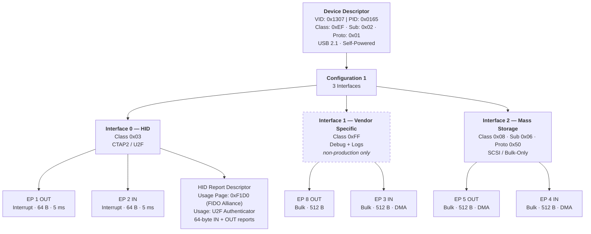
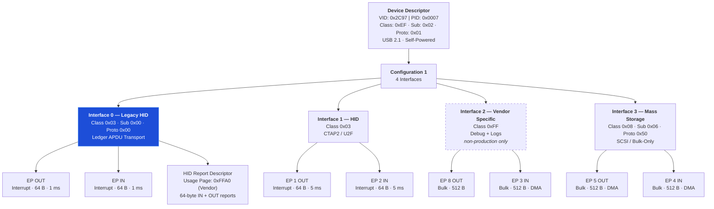
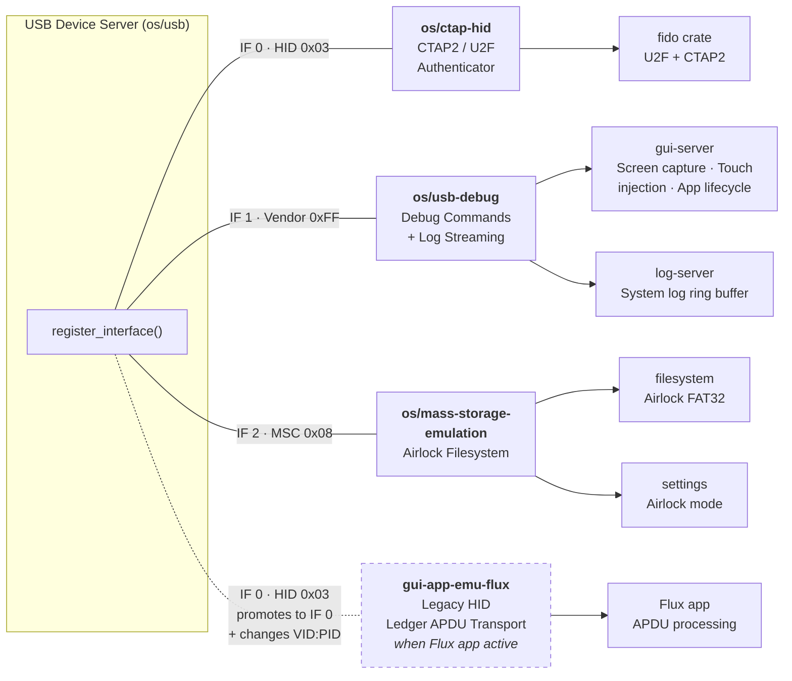
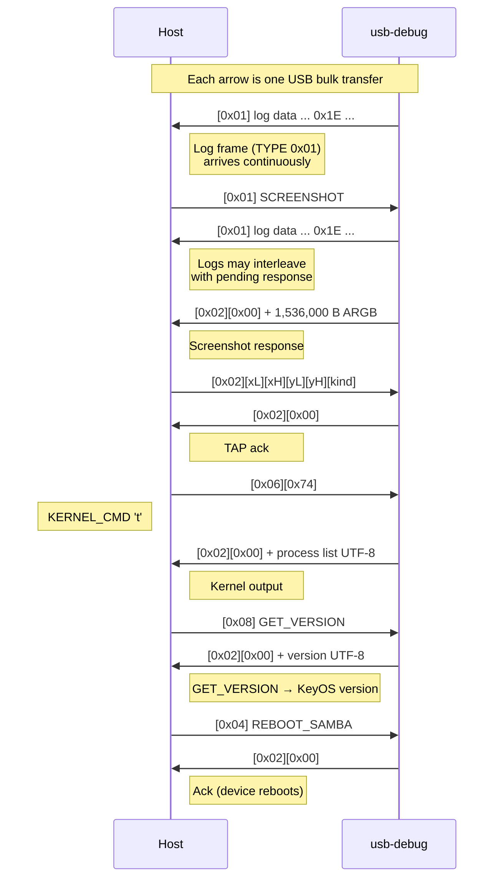

# Passport Prime USB Interface Architecture

Passport Prime presents itself as a USB 2.1 composite device using Interface Association
Descriptors (IAD) to group its three functions under a single configuration.

| Field | Value |
|-------|-------|
| VID:PID | `0x1307:0x0165` |
| Device Class | `0xEF` (Miscellaneous / IAD) |
| Manufacturer | Foundation Devices, Inc. |
| Product | Passport Prime |
| Max Power | 32 mA (self-powered) |

Each KeyOS server registers its interface(s) dynamically at boot by calling
`register_interface()` on the central USB device server (`os/usb`). The interface
numbers below reflect the default registration order in a standard development build.

## USB Descriptor Tree — Normal Mode



> Interface 1 (dashed) is excluded from production firmware by a `compile_error!` guard
> in `os/usb-debug/src/main.rs`.

## USB Descriptor Tree — Legacy Mode (Flux Emulator Active)

When a Flux app launches, `gui-app-emu-flux` switches the device to Ledger Flex
identity. The Legacy HID interface is promoted to Interface 0 and the existing
interfaces shift down. The VID:PID change triggers a USB disconnect / re-enumeration.
When the Flux app exits, the normal identity is restored (another re-enumeration).



> The Legacy HID interface (blue) is promoted to position 0 so that host wallets
> (e.g. MoneroGUI) see it as the primary HID interface, matching a real Ledger Flex.

## KeyOS Server Mapping



> The Legacy HID registration (dashed) only occurs while a Flux app is running.

---

## USB-Debug Interface — Protocol Reference

The vendor-specific debug interface (class `0xFF`) carries both debug commands and
system logs on a single pair of bulk endpoints. It is only present in non-production
firmware builds (enabled automatically for all `just build` / `just sim` invocations).

**Source files:**
- Device side: `os/usb-debug/src/main.rs`, `os/usb-debug/src/protocol.rs`
- Host side: `utils/passport-drive/src/usb_transport.rs`

### Frame Format

Each frame is a single USB bulk transfer, terminated by a short packet or ZLP.

**Host to Device (OUT endpoint):**

```
┌──────┬────────────────────┐
│ CMD  │ PAYLOAD (0..N)     │
│ 1 B  │                    │
└──────┴────────────────────┘
```

**Device to Host (IN endpoint):**

Log frames and debug responses are multiplexed on the same IN endpoint, distinguished
by a 1-byte TYPE prefix.

```
TYPE 0x01 — Log data:
┌──────┬─────────────────────────────────────┐
│ 0x01 │ UTF-8 log bytes (0x1E-terminated)   │
│ 1 B  │                                     │
└──────┴─────────────────────────────────────┘

TYPE 0x02 — Debug response:
┌──────┬────────┬──────────────────────┐
│ 0x02 │ STATUS │ Response data (0..N) │
│ 1 B  │ 1 B    │                      │
└──────┴────────┴──────────────────────┘
  STATUS: 0x00 = OK, 0x01 = Error
```

### Command Table

| Byte | Name | Payload (Host → Device) | Response (Device → Host) |
|------|------|-------------------------|--------------------------|
| `0x01` | `SCREENSHOT` | — | 1,536,000 bytes (480 x 800 x 4, ARGB8888) |
| `0x02` | `TAP` | `x_lo x_hi y_lo y_hi kind` (5 B, LE) | Ack (empty) |
| `0x03` | `POWER_BTN` | 1 B: `0x00` = release, else = press | Ack (empty) |
| `0x04` | `REBOOT_SAMBA` | — | Ack, then device reboots into SAM-BA |
| `0x05` | `CLOSE_APP` | `pid_lo pid_hi` (2 B LE) | Ack (empty) |
| `0x06` | `KERNEL_CMD` | 1 B: command character (see below) | Kernel debug output (variable) |
| `0x07` | `INPUT_TEXT` | UTF-8 text bytes | Ack (empty) |
| `0x08` | `GET_VERSION` | — | KeyOS version UTF-8 string |

The current checked-in protocol does not define a `LAUNCH_APP` debug command.
Do not use `0x08` for app launch; it is reserved for `GET_VERSION`.

**TAP touch kinds:** `0` = Press, `1` = Release, `2` = Drag. Screen coordinates:
origin top-left, 480 x 800 pixels.

### Kernel Debug Sub-Commands (CMD `0x06`)

| Char | Description |
|------|-------------|
| `h` | Help / command list |
| `i` | IRQ statistics |
| `m` | MMU state |
| `p` | Process list (verbose) |
| `t` | Process list (compact) |
| `s` | Server list |
| `c` | Cache statistics |
| `a` | AppID to PID mapping |
| `o` | Memory ownership |
| `k` | Consistency check |

### Wire Protocol — Sequence Diagram



**Log retention:** The `log-server` keeps a **16 KB ring buffer** that overwrites
old entries unconditionally — there is no backpressure to writers. When a host tool
connects, its `LogReader` receives up to 16 KB of the most recent logs already in
the ring, then streams new logs going forward. If the host stops draining (or
disconnects), the reader's position is eventually lapped by the write pointer and
the intermediate logs are silently lost. In practice this means that after extended
uptime you will see the last ~16 KB of log output on connect and everything before
that is gone.

---

See [Legacy Mode HID — Ledger-Compatible APDU Interface](legacy-mode-hid.md) for
the full protocol reference on the Ledger-compatible HID interface used by Flux apps.

---

## Host-Side Tools

Two checked-in tools communicate with the USB-debug interface from the host.

### passport-drive

**Location:** `utils/passport-drive/`

A Rust CLI and MCP (Model Context Protocol) server for driving Passport Prime
over USB. It is the most feature-complete host tool.

- **Transport:** `rusb` crate. Auto-detects the vendor-specific interface (class
  `0xFF`) by iterating the USB config descriptor. A background reader thread
  demuxes IN frames into separate `log_rx` and `resp_rx` channels.
- **Debug commands used:** All 8 (`0x01`–`0x08`).
- **Additional capabilities:**
  - SAM-BA bootloader mode: flash read / write / verify (via `sambuca` crate).
  - HID APDU exchange: CTAP/FIDO mode (usage page `0xF1D0`) and Ledger mode
    (VID `0x2C97`, usage page `0xFFA0`) on Interface 0.

### keyos-log-viewer

**Location:** `utils/keyos-log-viewer/`

A Rust TUI application built with `ratatui` for real-time log streaming, filtering,
and search.

- **Transport:** `rusb` crate with the same vendor interface auto-detection.
  Auto-reconnects on device disconnect.
- **Debug commands used:** `0x06` only (`KERNEL_CMD` with character `'t'` for
  compact process list snapshots).
- **Log parsing:** Accumulates bytes from TYPE `0x01` frames, splits on `0x1E`
  record terminators.

### Tool Command Matrix

| Capability | passport-drive | keyos-log-viewer |
|------------|:-:|:-:|
| `0x01` SCREENSHOT | x | |
| `0x02` TAP | x | |
| `0x03` POWER_BTN | x | |
| `0x04` REBOOT_SAMBA | x | |
| `0x05` CLOSE_APP | x | |
| `0x06` KERNEL_CMD | x | x |
| `0x07` INPUT_TEXT | x | |
| `0x08` GET_VERSION | x | |
| Log Streaming (TYPE 0x01) | x | x |
| SAM-BA Flash R/W | x | |
| HID APDU (CTAP + Ledger) | x | |

---

## Alternative USB Identities

| Mode | VID:PID | When |
|------|---------|------|
| Normal | `0x1307:0x0165` | Standard boot, no Flux app running |
| Legacy | `0x2C97:0x0007` | While the Flux emulator is on screen (Ledger Flex identity) |

The device switches between identities at runtime. When a Flux app launches,
`gui-app-emu-flux` calls `set_custom_vid_pid(0x2C97, 0x0007)` and the USB bus
re-enumerates with the Ledger Flex identity. When the Flux app exits, the normal
VID:PID is restored and the bus re-enumerates again. Each transition is visible
to the host as a USB disconnect followed by a new device appearing.

All three host tools try the normal VID:PID first, then fall back to the Legacy one.

**CDC ACM serial** (`os/logging/usb-serial`): An optional logging transport that
adds two extra interfaces (CDC control + CDC data). Excluded from normal builds;
only enabled via the `--log-usb-serial` build flag for special production debugging.
